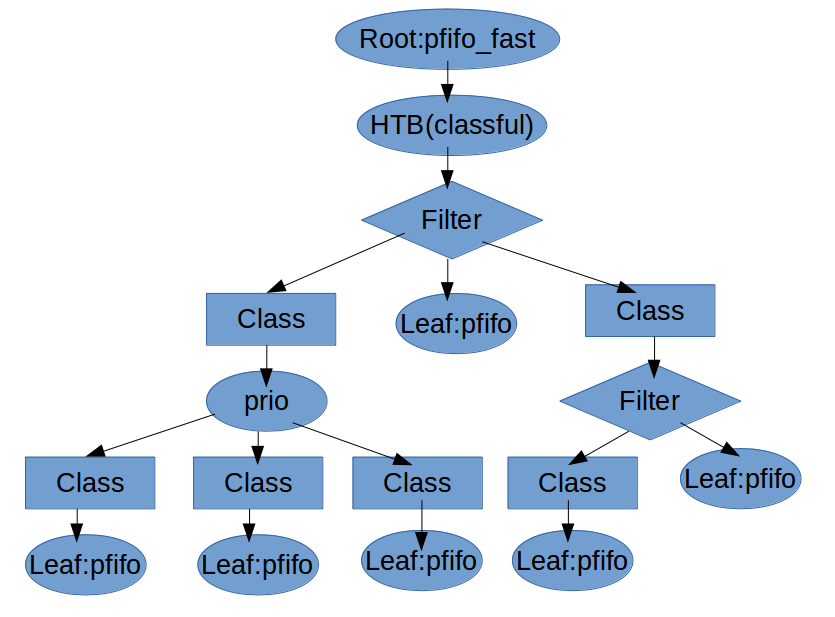

# 
使用IFB进行Ingress流量控制

----

## 流量控制

Linux的Traffic Control（以下简称TC）是linux内核中内置的流量控制模块，通过该模块可以进行网络端口的收发流量控制，包括流量限速、流量整形、模拟丢包等功能。TC主要通过三种元素——qdisc、class、filter组成的树状结构来管理多种流量控制规则。

#### QDISC

QDISC即队列规则，TC通过各种不同的队列规则来实现数据包的收发控制。队列规则主要分为两大类——可分类队列和不可分类队列。可分类的队列通过filter（或ToS、priority）的过滤后可以分为不同的class，从而为每个class单独配置队列规则。与之相反，不可分类队列只能应用在叶子节点，无法继续分类。

##### 可分类队列

+ cbq：       class based queueing，基于类别的队列
+ htb：       hierarchy token bucket，分层令牌桶
+ prio：      优先队列（不可动态分配）

##### 不可分类队列

+ [p|b]fifo： 以包或字节为单位的先入先出队列
+ pfifo_fast：默认的先入先出队列
+ tbf：       token bucket filter，令牌桶过滤器
+ red：       random early detection，随机早期检测
+ sfq：       stochastic fairness queuing，随机公平队列

##### QDISC命令详解

    tc [ OPTIONS ] qdisc [ add | change | replace | link | delete ] dev
           DEV [ parent qdisc-id | root ] [ handle qdisc-id ] [ ingress_block
           BLOCK_INDEX ] [ egress_block BLOCK_INDEX ] qdisc [ qdisc specific
           parameters ]

OPTIONS参数为qdisc命令的可选参数，具体每项效果如下：

    OPTIONS := { [ -force ] -b[atch] [ filename ] | [ -n[etns] name ] |
           [ -nm | -nam[es] ] | [ { -cf | -c[onf] } [ filename ] ] [
           -t[imestamp] ] | [ -t[short] | [ -o[neline] ] }

+ -b, -b filename, -batch, -batch filename 
    + 批量执行TC命令。从指定的文件或是标准输入读取命令，运行出错时会导致TC的中止。

+ -force
    + 强制执行。批量执行TC命令时不会因为错误而中止运行。运行过程中若出错，运行完毕后的返回值非零。

+ -o, -oneline
    + 单行输出模式。将每条记录输出到单独的一行中，原有的换行符会被替换为'\'。通常应用于记录的计数中，如wc和grep命令。 

+ -n, -net, -netns <NETNS>
    + 切换命名空间。将TC切换到指定的网络命名空间NETNS。

+ -cf, -conf <FILENAME>
    + 指定配置文件的路径。

+ -t, -timestamp
    + TC监视器运行时，在事件消息前打印时间戳。 
    + 时间戳格式为\<Day\> \<Month\> \<DD\> \<hh:mm:ss\> \<YYYY\> \<usecs\>。

+ -ts, -tshort
    + TC监视器运行时，在事件消息前打印短时间戳。
    + 时间戳格式为\<YYYY\>-\<MM\>-\<DD\>T\<hh:mm:ss\>.\<ms\>

操作参数：

    [ add | change | replace | link | delete ]

+ add    
    + 向节点增加一个队列，需要明确父节点的ID或者加入根节点。qdisc需要以handle参数进行命名。不可分类队列只能添加给root节点。

+ change
    + 修改某个节点上的队列，语法规则与add相同。但需要注意，无法修改某个节点的父节点，也无法修改节点本身的handle。

+ delete
    + 通过节点的handle可以删除某个节点，同时该节点的所有后代节点（包括节点上的队列，分类器等）都会被一起删除。root节点也可以被删除，删除root节点会使整个设备的分类规则变回pfifo_fast。

+ replace
    + 近似原子性地对某个已存在的节点执行删除和增加操作，如果节点不存在就只增加。
    

#### CLASS

类(Class)组成一个树，每个类都只有一个父类，而一个类可以有多个子类。某些qdisc(例如：cbq和htb)允许在运行时动态添加类，而其它的qdisc(例如：prio)不允许动态建立类。允许动态添加类的qdisc可以有零个或者多个子类，由它们为数据包排队。此外，每个类都有且仅有一个叶子qdisc。默认情况下，这个叶子qdisc使用pfifo_fast的方式排队。我们也可以使用其它类型的qdisc代替这个默认的qdisc，而且这个qdisc可以再次分类。

#### FILTER

过滤器（filter）通过匹配数据包头部的域或iptable的标记对数据包进行分类，将数据包分发给匹配的子类。如果所有子类都不匹配，过滤器会将数据包发送给当前类的叶子qdisc。
除了过滤器以外，有些qdisc还支持ToS（服务类型）分类方式。

#### Ingress & Egress

TC默认的egress根节点是1:0，而ingress节点需要通过如下命令进行添加才可以进行操作。

    //添加ingress节点
    tc qdisc add dev eth0 ingress

ingress节点的标号为ffff:0，这个节点无法添加子类，只能通过过滤器进行限速。因此我们需要ifb来实现对ingress的流量控制。

    //为ingress节点添加过滤器
    tc filter add dev eth0 parent ffff: protocol ip prio 10 \
      u32 match ip src 0.0.0.0/0 \
      police rate 2048kbps burst 1m drop flowid :1

#### TC命令实例

    //在根节点添加htb队列，未分类的包默认发送给1:1子类
    tc qdisc add dev eth0 root handle 1:htb default 1
    //以1：为父节点，创建标号为1:1的子类，子类使用htb队列规则，且速率上下限均为40mbps
    tc class add dev eth0 parent 1: classid 1:1 htb rate 40mbit ceil 40mbit
    /*
      protocol ip表示该过滤器应该检查报文分组的协议字段。
      prio 1表示优先级，对于不同优先级的过滤器，系统将按照从小到大的优先级顺序来执行过滤器。
      对于相同的优先级，系统将按照命令的先后顺序执行。
      这个过滤器还用到了u32选择器，判断的是dport字段。
      如果该字段与Oxffff进行与操作的结果是8O，则flowid 1:1表示将把该数据流分配给类别1:1
    */
    tc filter add dev eth0 protocol ip parent 1:0 prio 1 u32 match ip dport 80 0xffff flowid 1:1

#### NETEM

NETEM是TC的一个增强组件，它可以在TC队列规则的基础上模拟网络波动，实现延迟、丢包、重复、损坏、乱序等效果。与QDISC类似，NETEM选项也是直接应用于class。

##### 延迟（Delay）：     

    DELAY := delay TIME [ JITTER [ CORRELATION ]]]
    [ distribution { uniform | normal | pareto |  paretonormal } ]

TIME参数即为延迟时间，单位ms。JITTER参数为浮动值，会使延迟时间在TIME±JITTER范围内浮动，默认值为0。CORREALATION参数代表了相关系数，默认值为100%，该参数会影响延迟时间的分布。默认情况下延迟时间的分布符合正态分布，通过修改distribution参数可以使用其他的分布函数。

    tc qdisc add dev eth0 root netem delay 100ms 10ms 30%
以上述命令为例，延迟时间为100±10ms，延迟时间的分布是正态分布。

##### 丢包（Loss）：

    LOSS := loss { random PERCENT [ CORRELATION ]  |
                      state p13 [ p31 [ p32 [ p23 [ p14]]]] |
                      gemodel p [ r [ 1-h [ 1-k ]]] }  [ ecn ]

random PERCENT参数代表了丢包率，CORRELATION是相关系数。

    tc qdisc add dev eth0 root netem loss 5% 50%
以上述命令为例，丢包率为5%。

##### 损坏（Corrupt）：

    CORRUPT := corrupt PERCENT [ CORRELATION ]]

和丢包相似，两个参数分别代表损坏率和相关系数。损坏的方式是以随机噪声修改数据包的随机位置。

    tc qdisc add dev eth0 root netem corrupt 3% 
以上述命令为例，发送的数据包会有3%被随机噪声损坏。

##### 重复（Dulplication）：

    DUPLICATION := duplicate PERCENT [ CORRELATION ]]

同样地，两个参数分别代表重复率和相关系数，被随机选中的数据包会发送两次。

    tc qdisc add dev eth0 root netem duplicate 7% 
以上述命令为例，发送的数据包会有7%重复发送。

##### 乱序（Reordering）：

    REORDERING := reorder PERCENT [ CORRELATION ] [ gap DISTANCE ]

乱序必须与延时同时设置才能够起效。PERCENT参数代表了乱序率，CORRELATION参数代表了相关系数，gap代表乱序间隔。

    tc qdisc add dev eth0 root netem delay 10ms reorder 25% 50% gap 5
以上述命令为例，发送的每5个数据包中，前四个会延迟10ms，而第五个有25%的几率直接发送，从而造成乱序。

## IFB

IFB的全称是Intermediate Functional Block，即中间功能块。由于TC只能对ingress流量进行限流，当我们需要对ingress流量进行整形时，就需要借助ifb进行转发。通过将ingress重定向至ifb，再于ifb的egress处添加队列规则，就能够实现对ingress的整形。

此外，在egress处也可以加入一个ifb进行映射，达到同样的配置应用于多块网卡的效果。

###### Redirect & Mirror

ifb的两种主要用法分别通过redirect和mirror实现。当我们需要对ingress整形时，采用redirect方式对数据包进行重定向发送，这样避免了原有的入口流量和经过整形后的入口流量重复接收。redirect参数下，该命令会将原有的ingress全部转发至ifb device，而不会发送给最初的接受网卡。

当我们需要监听流量时，就可以采用mirror参数。这种情况下，ingress会被复制一份发送到ifb device以供后续的监测处理，同时不会影响到正常的ingress接收。

    //这条命令可以将所有ingress的ip包重定向或镜像发送到ifb device0
    TC filter add dev eth0 parent ffff: protocol ip prio 1 u32 \
      match u32 0 0 flowid 1:1 \
      action mirred egress [redirect|mirror] dev ifb0

#### ifb配置实例

在远程配置ifb时，千万注意在配置完ifb的队列后再重定向ingress，否则可能会因为入口流量被重定向而无法连接远程服务器。

    //加载ifb模块
    modprobe ifb
    //启用虚拟设备ifb
    ip link set dev ifb0 up
    //配置ifb设备的队列，和上文配置网卡方式相同
    TC qdisc add dev ifb0 root handle 1: prio 
    TC qdisc add dev ifb0 parent 1:1 handle 10: sfq
    TC qdisc add dev ifb0 parent 1:2 handle 20: tbf rate 20kbit buffer 1600 limit 3000
    TC qdisc add dev ifb0 parent 1:3 handle 30:sfq
    TC filter add dev ifb0 protocol ip pref 1 parent 1: handle 1 fw classid 1:1
    TC filter add dev ifb0 protocol ip pref 2 parent 1: handle 2 fw classid 1:2
    //将ingress重定向至ifb
    tc filter add dev eth0 parent fff: protocol ip u32 match u32 0 0 flowid 1:1 action mirred egress redirect dev ifb0

###### 参考资料：

+ [Linux TC(Traffic Control) 简介](https://blog.csdn.net/zhaobryant/article/details/38797655)
+ [tc(8) - Linux manual page](http://www.man7.org/linux/man-pages/man8/tc.8.html)
+ [tc-netem(8) - Linux manual page](http://www.man7.org/linux/man-pages/man8/tc-netem.8.html)
+ [Linux模拟复杂网络环境下的传输（netem和tc）](https://blog.csdn.net/shelldon/article/details/54585742)
+ [networking:ifb [Linux Foundation Wiki]](https://wiki.linuxfoundation.org/networking/ifb)
+ [输入方向的流量控制](https://blog.csdn.net/zhangskd/article/details/8240290)
+ [Linux TC的ifb原理以及ingress流控](https://blog.csdn.net/dog250/article/details/40680765)
